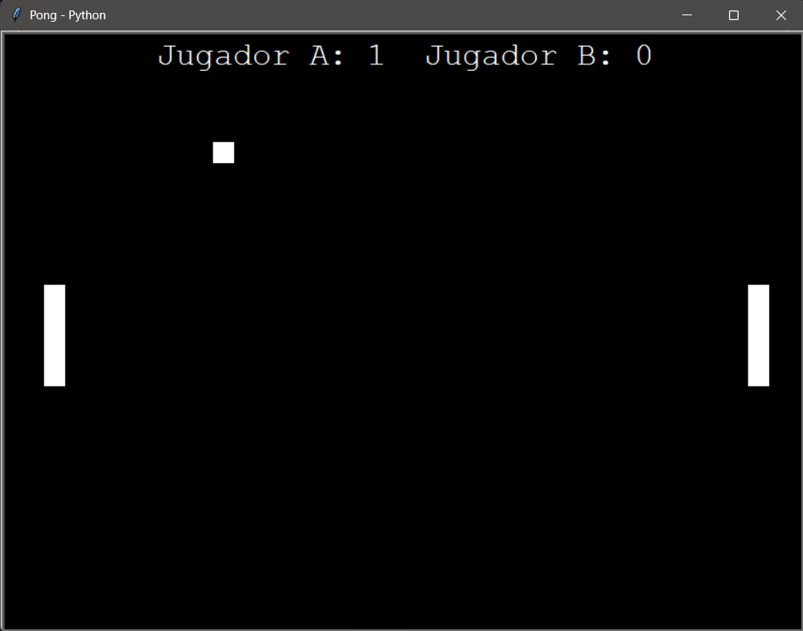

# 🏓 Pong Game - Python (Turtle)

Proyecto realizado en Python que recrea el clásico juego **Pong**, utilizando el módulo estándar `turtle`.  
Forma parte de mi proceso de aprendizaje en desarrollo y está enfocado en practicar **estructuración de código, lógica de juego y control de eventos**.

---

## 🎮 Captura del juego

---

## 🎯 Objetivo del proyecto

- Reforzar fundamentos de Python
- Trabajar con funciones y bucles
- Implementar lógica de juego
- Manejar eventos de teclado
- Aplicar refactorización progresiva
- Subir proyectos completos y documentados a GitHub

---

## 🧠 Funcionalidades

- 🎮 Juego Pong para dos jugadores
- ⬆⬇ Movimiento de paletas con teclado
- ⚽ Pelota con rebote en paredes y paletas
- 🚀 Aumento progresivo de velocidad al golpear paletas
- 📊 Marcador en tiempo real
- 🏁 Fin del juego al alcanzar puntaje máximo
- 🔁 Opción de volver a jugar
- ❌ Opción de cerrar el juego desde el teclado

---

## 🎮 Controles

| Acción | Tecla |
|------|------|
| Paleta izquierda arriba | `W` |
| Paleta izquierda abajo | `S` |
| Paleta derecha arriba | `↑` |
| Paleta derecha abajo | `↓` |
| Volver a jugar | `R` |
| Salir del juego | `Q` |

*(Las teclas funcionan tanto en mayúsculas como minúsculas)*

---

## 🛠️ Tecnologías utilizadas

- Python 3
- Módulo `turtle`
- Módulos estándar: `time`, `random`

No requiere librerías externas.

---

## 🚀 Posibles mejoras futuras

Agregar sonidos

Agregar dificultad progresiva

Modo jugador vs CPU

Menú inicial

---

## 👩‍💻 Autora

Marina Acerbi
Desarrolladora Web en formación

GitHub: https://github.com/Marina993366
